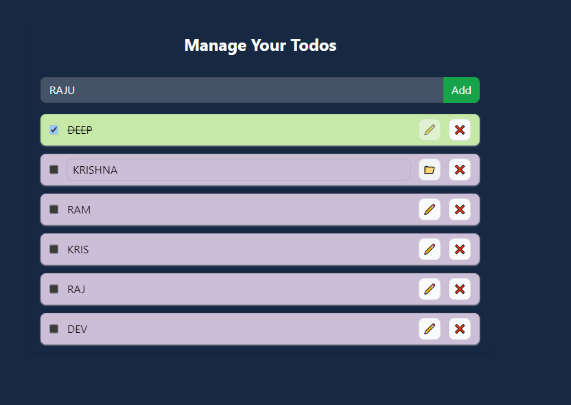

# React + Vite

This template provides a minimal setup to get React working in Vite with HMR and some ESLint rules.

Currently, two official plugins are available:

- [@vitejs/plugin-react](https://github.com/vitejs/vite-plugin-react/blob/main/packages/plugin-react/README.md) uses [Babel](https://babeljs.io/) for Fast Refresh
- [@vitejs/plugin-react-swc](https://github.com/vitejs/vite-plugin-react-swc) uses [SWC](https://swc.rs/) for Fast Refresh

<h2>Manage Your Todos in localstorage usecontext </h2>
 
 
 

 
use in

<code>
 
    import React, { createContext, useContext } from "react";

 
export const TodoContext = createContext({
 
    todos: [
 
        {
 
            id: 1,
 
            todo: "This Msg",
 
            completed: false
        }
 
    ],
    addTodo: (todo) => { },
    updateTodo: (id, todo) => { },
    deleteTodo: (id) => { },
    completedtodo: (id) => { }
})

export const Usetodo = () => {
    return useContext(TodoContext)
}
export const TodoProvider = TodoContext.Provider
  </code>
